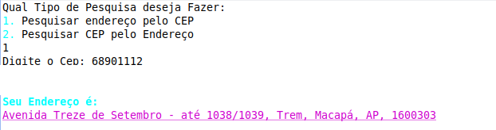
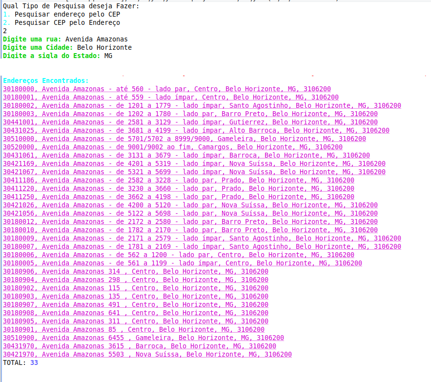

<h1 align="center">
  <br>
  <a href="https://github.com/ODGodinho"></a>
  <br>
  Web Service Java - CEP
  <br>
</h1>

<h4 align="center">Projeto Acadêmico 🚀!</h4>

<p align="center">	

  
	
  <a href="https://www.linkedin.com/in/victor-alves-odgodinho/">
    
  </a>
  
  <a href="https://github.com/ODGodinho/WebService-JavaCep/commits/master">
    
  </a>

  

   <a href="https://github.com/ODGodinho/WebService-JavaCep/stargazers">
    
  </a>
  
</p>


---

## 🖥 Tecnologias

#### `Back-end`

- [Java](https://www.java.com)

## 📁 Dependências

- registre-se em [http://www.byjg.com.br/](http://www.byjg.com.br/)

<br>


## 🔐 Credenciais

### `Credenciais .properties`
- renomeie o arquivo ***config.properties.example*** para ***config.properties*** e preencha com as credenciais de acesso do site http://www.byjg.com.br/ 

### `Credenciais Via Teclado`

```java
// Em Main.java atualize de
... = Authorization.getUseAuthorization(keyboard);

// Em Main.java atualize PARA
... = Authorization.getUseAuthorization(keyboard, 2);
```


## 🎴 como usar?

<br>

- Abra o eclipse-EE e execute o Arquivo Main


## 🍥 Layout 

- #### `CEP`

    

- #### `Endereço`

    

<br>

## 📙 Licença

> Com base nos termos de [MIT LICENSE](https://opensource.org/licenses/MIT)

<br>

##### Feito por DragonsGamers com 💕💘